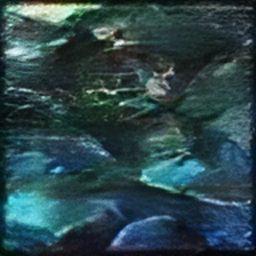
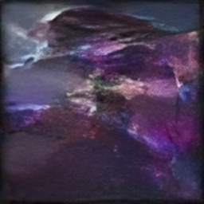
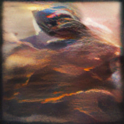

In this project, I used a DCGAN to train on a dataset containing the images of all League of Legends champions and their skins.
The dataset contains about 1784 files, which I realized is not plenty because DCGANs are thirsty for input data. However, I was still satisfied with the results.

Reference DCGAN code: https://jovian.ai/aakashns/06b-anime-dcgan

Dataset used: https://www.kaggle.com/datasets/yryruwehuhuiashd/league-of-legends-skins

These are some of the generated images:

  
  
  

In this case, I first trained lr=0.0002 for 200 epochs then 0.0001 for 100 epochs. batch size = 64.
The images were initially resized to be 64x64 for better training so the generated images are also 64x64 which was too small so I had to upscale the results by x4.
